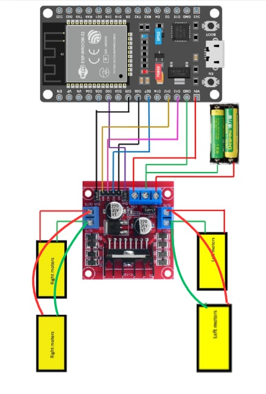
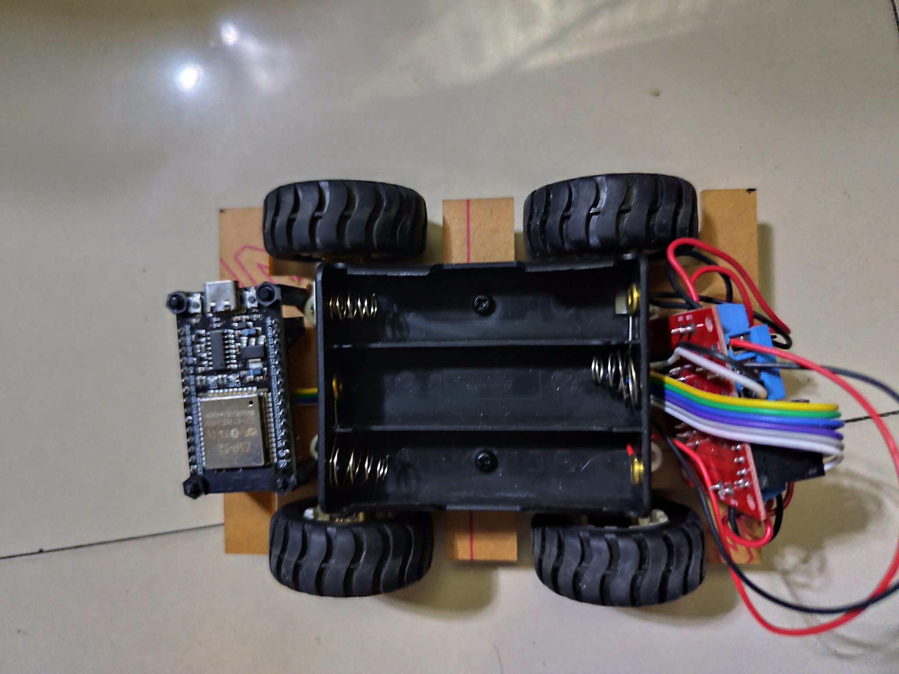
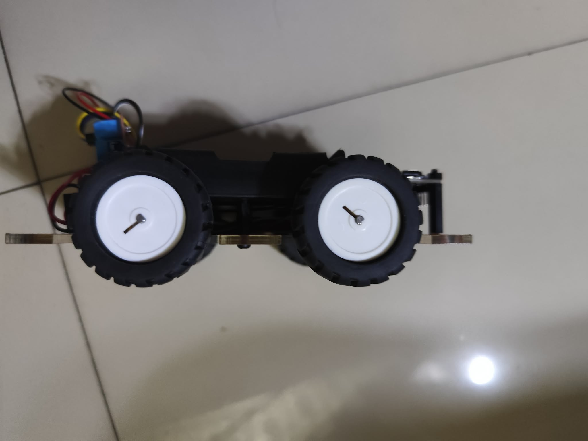
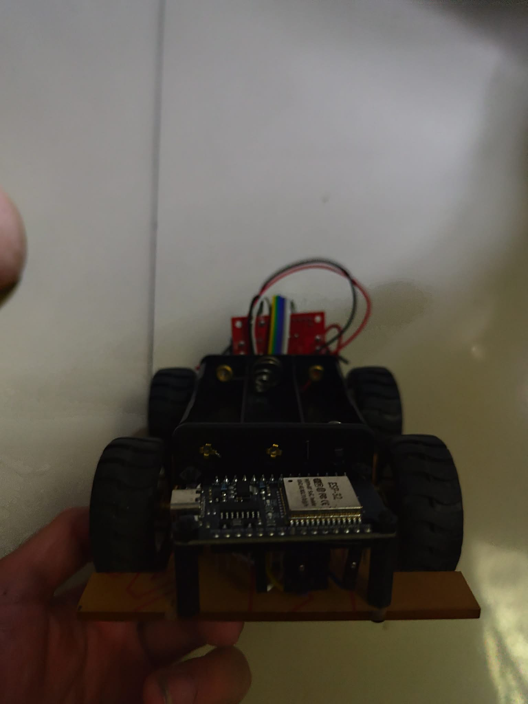
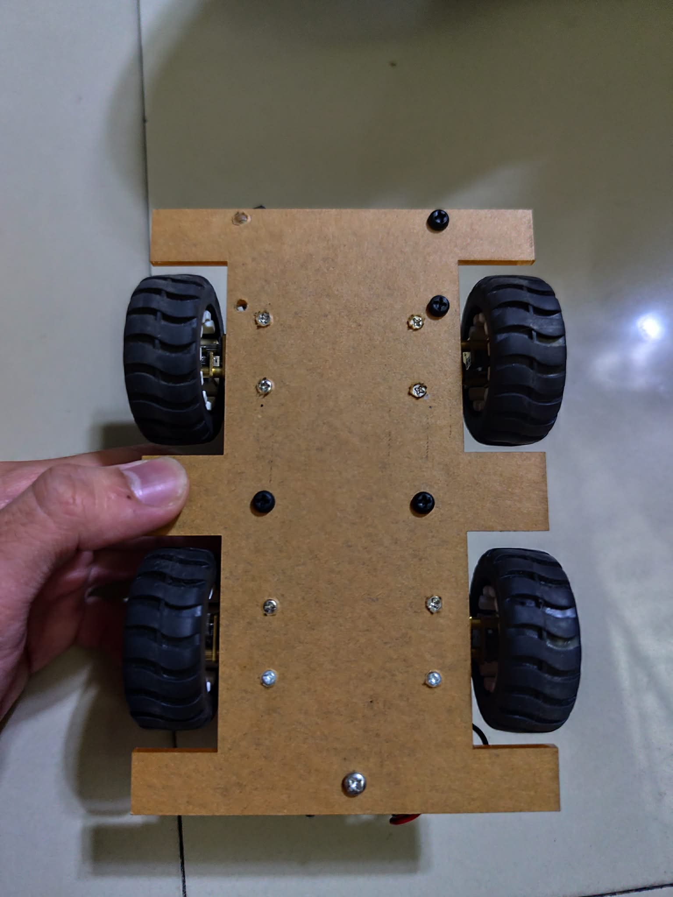

# RC-CAR-4wd

## **INTRODUCTION**

# 🤖 PS4-Controlled 4WD Robotic Rover

> *Bridging the gap between human intuition and autonomous mobility.*

Welcome to the documentation for the **PS4-Controlled 4WD Robotic Rover**. This project leverages the robust wireless capabilities of the **ESP32** to bridge a **Sony DualShock 4** controller with a high-torque 4WD drivetrain, exploring the intersection of HID protocols and motor control.

---

## 🛠 Project Overview
This Project is designed to provide responsive, tactile control using the Bluetooth Classic stack of the ESP32. By processing joystick and button events from the DualShock 4, the system translates human input into precise motor maneuvers.

### Key Technologies
| Component | Function |
| :--- | :--- |
| **ESP32** | Wireless MCU & Bluetooth Host |
| **PS4 Controller** | Human-Interface Device (HID) |
| **L293D** | Motor Driver (H-Bridge) |
| **DC Geared Motors** | 4WD Drivetrain Propulsion |

---
## 📦 Component Checklist

| Part | Specification |
| :--- | :--- |
| **Controller** | Sony PS4 DualShock 4 |
| **MCU** | ESP32 (WROOM-32) |
| **Motor Driver** | L293D H-Bridge |
| **Power** | 18650 Li-ion Battery + Holder |
| **Drivetrain** | 4x 12V 500RPM Geared Motors |
| **Chassis** | 4WD Bracket & Wheel Set |


## ⚙️ How It Works

### 1. Wireless Integration
The ESP32 acts as a Bluetooth central, pairing directly with the DualShock 4 controller. It captures packetized data from the controller, converting raw analog stick coordinates into steering vectors.

### 2. Drive Logic
The system utilizes **Pulse Width Modulation (PWM)** to regulate motor voltage, allowing for smooth acceleration and variable speed control. Differential steering is achieved by modulating the voltage across the left and right side motors independently, enabling tank-like rotation and precise navigation.

### 3. Motor Control Architecture
The **L293D** H-Bridge acts as the power interface, ensuring that the 3.3V logic signals from the ESP32 are safely stepped up to the current levels required by the four geared motors.

---
## 📐 Wiring Diagram



*Complete circuit schematic showing ESP32, L293D motor driver, 18650 batteries, and 4WD motor connections*

## PROJECT DOCUMENTATION

<details>
<summary><strong>📸 Project Gallery & Build Showcase</strong> <em>(Click to expand)</em></summary>

### 🎨 Visual Documentation Gallery

Experience the complete build journey of our RC 4WD rover:

| Image | Description |
| :--- | :--- |
|  | **TOP VIEW** -  |
|  | **SIDE VIEW**  |
|  | **FRONT VIEW**  |
|  | **BOTTOM VIEW** |

---

**Pro Tip:** 🚀 Expand this section to view high-resolution images of each build stage. Perfect for understanding the assembly workflow and troubleshooting!

</details>


### 📜 Technical Source Code
## 🕹️ PS4 Control Implementation (Bluepad32)

This project utilizes the **Bluepad32** library to interface the Sony DualShock 4 controller with the ESP32. The code maps the analog stick values to PWM signals for smooth, variable-speed motor control.

```cpp
#include <Bluepad32.h>

// Global Controller Reference
ControllerPtr myControllers[BP32_MAX_GAMEPADS];

// L293D Pin Mapping
const int enA = 5;
const int enB = 4;
int up = 21;    // Motor 1 Terminal A
int down = 22;  // Motor 1 Terminal B
int left = 18;  // Motor 2 Terminal A
int right = 19; // Motor 2 Terminal B

// Joystick Data Variables
int R_xvalue = 0; 
int L_yvalue = 0;
int upSpeed, downSpeed, leftSpeed, rightSpeed;

// PWM Configuration
const int pwmChannelA = 0; 
const int pwmChannelB = 1; 
const int pwmFreq = 5000;
const int pwmResolution = 8;

void onConnectedController(ControllerPtr ctl) {
    for (int i = 0; i < BP32_MAX_GAMEPADS; i++) {
        if (myControllers[i] == nullptr) {
            Serial.printf("CALLBACK: Controller is connected, index=%d\n", i);
            myControllers[i] = ctl;
            break;
        }
    }
}

void onDisconnectedController(ControllerPtr ctl) {
    for (int i = 0; i < BP32_MAX_GAMEPADS; i++) {
        if (myControllers[i] == ctl) {
            Serial.printf("CALLBACK: Controller disconnected from index=%d\n", i);
            myControllers[i] = nullptr;
            break;
        }
    }
}

void setup() {
    Serial.begin(115200);
    BP32.setup(&onConnectedController, &onDisconnectedController);
    BP32.forgetBluetoothKeys();
    
    pinMode(enA, OUTPUT); pinMode(enB, OUTPUT);
    pinMode(up, OUTPUT);  pinMode(down, OUTPUT);
    pinMode(right, OUTPUT); pinMode(left, OUTPUT);

    ledcSetup(pwmChannelA, pwmFreq, pwmResolution);
    ledcAttachPin(enA, pwmChannelA);
    ledcSetup(pwmChannelB, pwmFreq, pwmResolution);
    ledcAttachPin(enB, pwmChannelB);
    
    stop(); 
}

void loop() {
    BP32.update();
    for (auto myController : myControllers) {
        if (myController && myController->isConnected() && myController->hasData()) {
            R_xvalue = myController->axisRX();
            L_yvalue = myController->axisY();
        }
    }

    // Mapping Joystick (-512 to 512) to PWM (0 to 255)
    upSpeed = map(L_yvalue, -20, -512, 0, 255);
    downSpeed = map(L_yvalue, 20, 512, 0, 255);
    leftSpeed = map(R_xvalue, -20, -512, 0, 255);
    rightSpeed = map(R_xvalue, 20, 512, 0, 255);

    // Motor Logic for Turning and Driving
    if (L_yvalue < -20) { drive(HIGH, LOW, LOW, HIGH, upSpeed); } 
    else if (L_yvalue > 20) { drive(LOW, HIGH, HIGH, LOW, downSpeed); } 
    else if (R_xvalue < -20) { drive(HIGH, LOW, HIGH, LOW, leftSpeed); } 
    else if (R_xvalue > 20) { drive(LOW, HIGH, LOW, HIGH, rightSpeed); } 
    else { stop(); }
    
    delay(20); 
}

void drive(int u, int d, int l, int r, int speed) {
    digitalWrite(up, u); digitalWrite(down, d);
    digitalWrite(left, l); digitalWrite(right, r);
    ledcWrite(pwmChannelA, speed);
    ledcWrite(pwmChannelB, speed);
}

void stop() {
    ledcWrite(pwmChannelA, 0); ledcWrite(pwmChannelB, 0);
    digitalWrite(up, LOW); digitalWrite(down, LOW);
    digitalWrite(left, LOW); digitalWrite(right, LOW);
}

